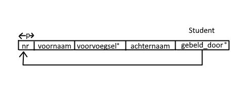
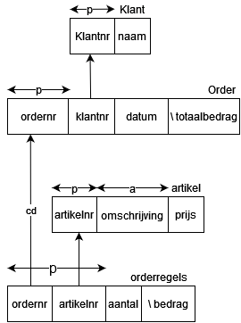
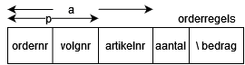
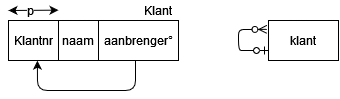
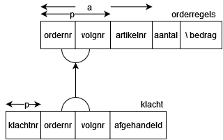
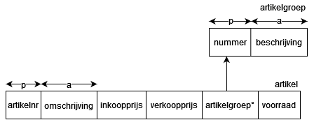
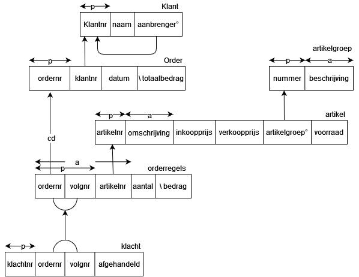

# Tuesday 14 September - WC - Lesson 2

## Notes

- Optional columns in a bar diagram is marked with a degree symbol `°`
- Unique columns are marked with an arrow across them. The arrow cannot cover
  an calculated column
- Primary keys are marked with an arrow again, but this time with a `p` in the
  center of the arrow. Primary key is required, not optional.
- Foreign keys is marked with an arrow starting from the child to the parent
  field. Prob not the best explanation, see the child field as a key and the
  parent as a lock

Relationships between columns are marked with a line between them. The ends of
the line have symbols marking what relationship it is.

- `o|` means 0 or one
- `||` means exactly one
- `o<` means 0 or more
- `|<` means 1 or more

(pretend that `<` has a line in between the two lines)

- transaction are a thing, commit when successful and rollback when not.
- Cascading update will update all parents when a fk is updated.

## Work

During class:
2.1 - 2.5 + 2.7

Homework:
2.8 - 2.14

**2.1**:

- a. Elke tabel verwijst naartill een andere tabel.
- b. `Ingredient` verwijst naar `Gerecht` en `Product`.
- c. Er wordt niet naar `Ingredient` gewezen. Hij wijst alleen naar tabelen.

**2.2**:
b

**2.3**:
c

**2.4**:
Ze zijn beide een ouder en een kind van elkaar.

**2.5**:

- a. Foutmelding, vanille komt niet voor in `Product`.
- b. Foutmelding, suiker bestaat al voor het gerecht.
- c. fout: koffielepel bestaat (nog) niet.
- d. Slagroom word toegevoegd.
- e. fout: hij word nog gebruikt als ingredient.
- f. De rij met banaan word verwijderd.
- g. Gerecht word verwijderd samen met de ingredienten die bij het recept horen.
- h. Rij wordt geupdate samen met de references in `Ingredient`.
- i. Foutmelding, `pond` bestaat (nog) niet in `Eendheid`.
- j. Foutmelding, het veld is verplicht.

**2.7**

| nr  | voornaam | voorvoegsel | achternaam | gebeld_door |
| --- | -------- | ----------- | ---------- | ----------- |
| 1   | Inge     |             | Berk       |             |
| 2   | Max      |             | Tack       | 1           |
| 3   | Wim      |             | Bos        | 2           |
| 4   | Iris     | van         | Eik        | 2           |
| 5   | Soffie   | van         | Esch       | 1           |
| 6   | Pim      |             | Hazelaar   | 5           |
| 7   | Cees     | in 't       | Woud       | 5           |
| 8   | Anna     |             | Roos       | 6           |

**2.8**

**2.9**
De primary key word nu de combinatie tussen ordernr en volgnr. Maar omdat het
nog steeds niet logisch is dat er twee keer de zelfde product bij een bestelling
zit blijft er een unique (alternate) key van order-artikel zitten.

**2.10**
In de klant tabel moet een kolom worden toegevoegd, deze wijst naar de klantnr
van degene die de nieuwe klant had uitgenodigd. Dit is een optionele veld.

**2.11**

**2.12**
???

**2.13**

**2.14**

