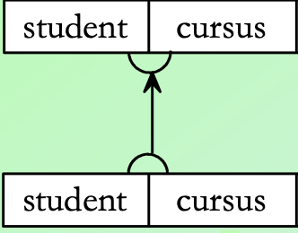
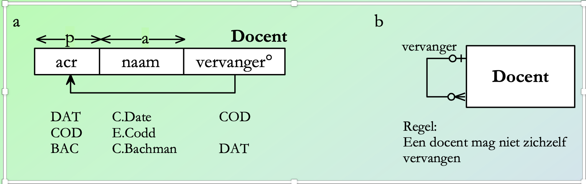

# Tuesday 15 September - WC - Lesson 3

## Notes

met samengestelde sleutels word het gemarkeerd met een mooi half cirkeltje

Tabellen die naar zich zelf wijzen:

Niet sleutel verwijzing, klinkt redelijk nutteloos. Handig
voor ranges van dingen, bijvoorbeeld met selectie van postcodes.

##

lening
dvd_nr
klant_nr
datum_uit
datum_terug
dagen
datum_in
/ boete °
/ totaal

dvd
dvd_nr
titel
duur
categorie_id
prijs
regisseur_code
producer_code
opbrengst

Regisseur
code
voornaam
achternaam

producer
code
naam

categorie
id
omschrijving

klant
klant_nr
naam
