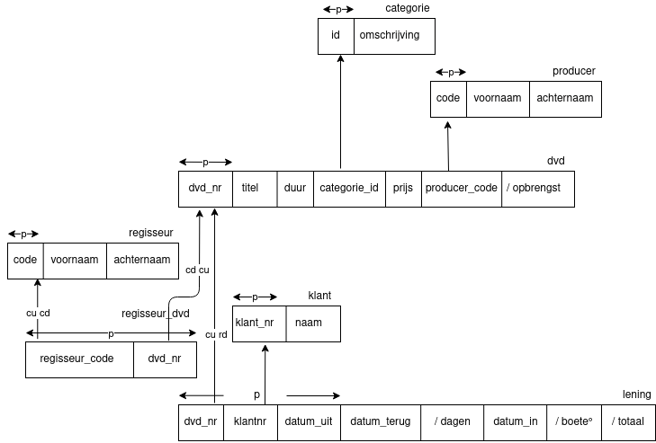

# Tuesday 15 September - WC - Lesson 3

## Notes

met samengestelde sleutels word het gemarkeerd met een mooi half cirkeltje

Tabellen die naar zich zelf wijzen:

Niet sleutel verwijzing, klinkt redelijk nutteloos. Handig
voor ranges van dingen, bijvoorbeeld met selectie van postcodes.

## Opdracht

